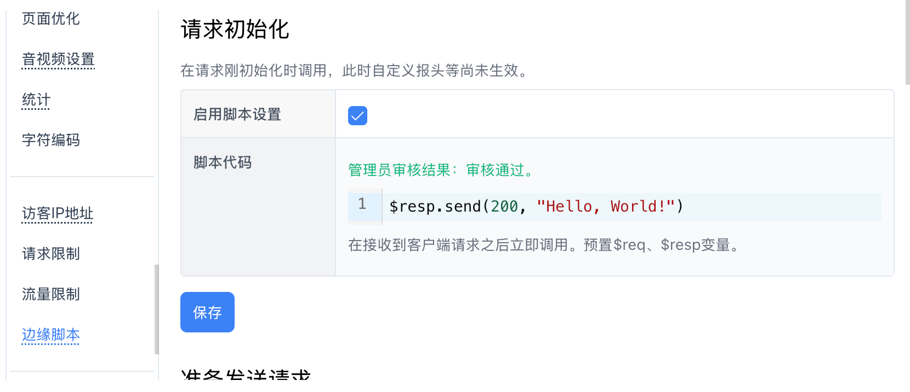

# 快速入门

从 FlexCDN v2026.1.7 版本开始，开始引入 FlexLang 语言（基于ExprLang表达式语言）代替先前的 Javascript，用于在边缘节点运行并修改请求和响应。

以下使用`Hello, World!`来快速演示如何使用边缘脚本。

## 第一步：Hello, World!

在我们的网站`设置` - `边缘脚本`菜单对应页面中，启用 `启用脚本设置`，然后填入以下脚本代码：

~~~javascript
$resp.send(200, "Hello, World!")
~~~

脚本解读：

* `$resp` 为内置对象，用来操作服务器响应结果
	* `$resp.send(200, "Hello, World!")` 为调用 `$resp` 的函数 `send` 来发送自己的响应结果
		* `200` - 响应状态码
		* `Hello, World!` - 响应内容
	* 更多函数参考 [Response对象](./references.md#response对象)

界面如下：

然后点击下面的`保存`按钮进行保存。如果非管理员操作，你需要等管理员审核通过后才能测试。

这时候访问你的网站的任一页面，比如 `https://你的域名/index.html`，都会返回：

~~~
Hello, World!
~~~

那么恭喜你，你已经完成了第一步！

## 第二步：限制要操作的URL

在第一步中，我们访问任何页面都会输出同样的`Hello, World!`，很自然地，我们希望只有访问某个固定页面的时候，才会输出这样的提示，其他页面仍然正常从源站或缓存中读取。

比如我们只想要 `/hello` 页面执行边缘脚本，可以使用以下代码：

~~~javascript
if ($req.path() == "/hello") {
	$resp.send(200, "Hello, World!")
}
~~~

脚本解读：

* `$req` 为内置对象，用来读取和修改请求信息
	* `$req.path() == "/hello"` 为调用 `$req` 的函数 `path` 来获取当前请求的URL中的路径部分
		* 两个等于号 `==` 可以用来对比两个字符串是否一致
	* 更多函数参考 [Request对象](./references.md#request对象)
* `$resp` 为内置对象，用来操作服务器响应结果
	* `$resp.send(200, "Hello, World!")` 为调用 `$resp` 的函数 `send` 来发送自己的响应结果
		* `200` - 响应状态码
		* `Hello, World!` - 响应内容
	* 更多函数参考 [Response对象](./references.md#response对象)

这时候，访问 `/hello` 和 `/hello?v=123` 之类的页面都会显示 `Hello, World!`，而访问 `/index.html` 之类的，则正常返回原有的内容。

## 后续要了解的内容

你在当前教程中已经了解到了如何定制返回的内容以及如何限制执行脚本的URL，以下是进一步学习和了解的内容：
* [语言参考](./lang.md)
* [变量和函数参考](./references.md)
* [更多示例](./examples.md)
* [常见问题](./faq.md)